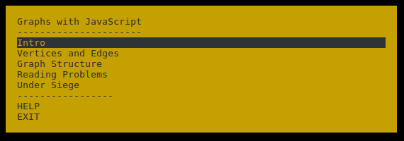

This is a tutorial on graph algorithms. It is using [adventure](https://www.npmjs.com/package/adventure).

Install this adventure with

    npm install -g graphs-with-javascript

and then use

    g-w-j

to start your adventure!

**Note for Windows users:** You have to [download Node.js v0.12.6](http://nodejs.org/dist/v0.12.6/node-v0.12.6-x86.msi)
for Windows since adventure will not work with 4.x yet. [See this bug.](https://github.com/nodeschool/discussions/issues/1448)

## What you will learn

Goal is to write a number of different exercises which will give you a good understanding of graphs and using them
to solve various types of problems. More exercises will be added. Current progress:

                                 v problem         v verifier           v
                                 | written         | written            | done
                                 
    Introduction ————————————————·—————————————————·————————————————————O
    Get started with this adventure and verify your first exercise.
    
    Vertices + Edges ————————————·—————————————————·————————————————————O
    Create a data structure for edges and vertices; preparation for
    later exercises.
    
    Graphs ——————————————————————·—————————————————·————————————————————O
    Create a Graph data structure which manages the vertices and edges
    from the previous exercise.
    
    Reading Problems ————————————·—————————————————·————————————————————O
    Read large graphs from files.
    
    Under Siege —————————————————·————————————
    Help the city Bohandur, which is under siege, to defend itself 
    with your new knowledge!

## Feedback

I’m very interested in reading your feedback to the exercises, like:

* Did you miss some information which would have been required for solving the exercise?
* Was an exercise too hard?
* Did the verification fail, or was the master solution wrong?
* Did you like it?

Please feel free to open a thread (issue) in the [GitHub Issue Tracker](https://github.com/Granjow/graphs-with-javascript/issues)
and drop some lines of text or code, so this tutorial can be further improved. Thank you!